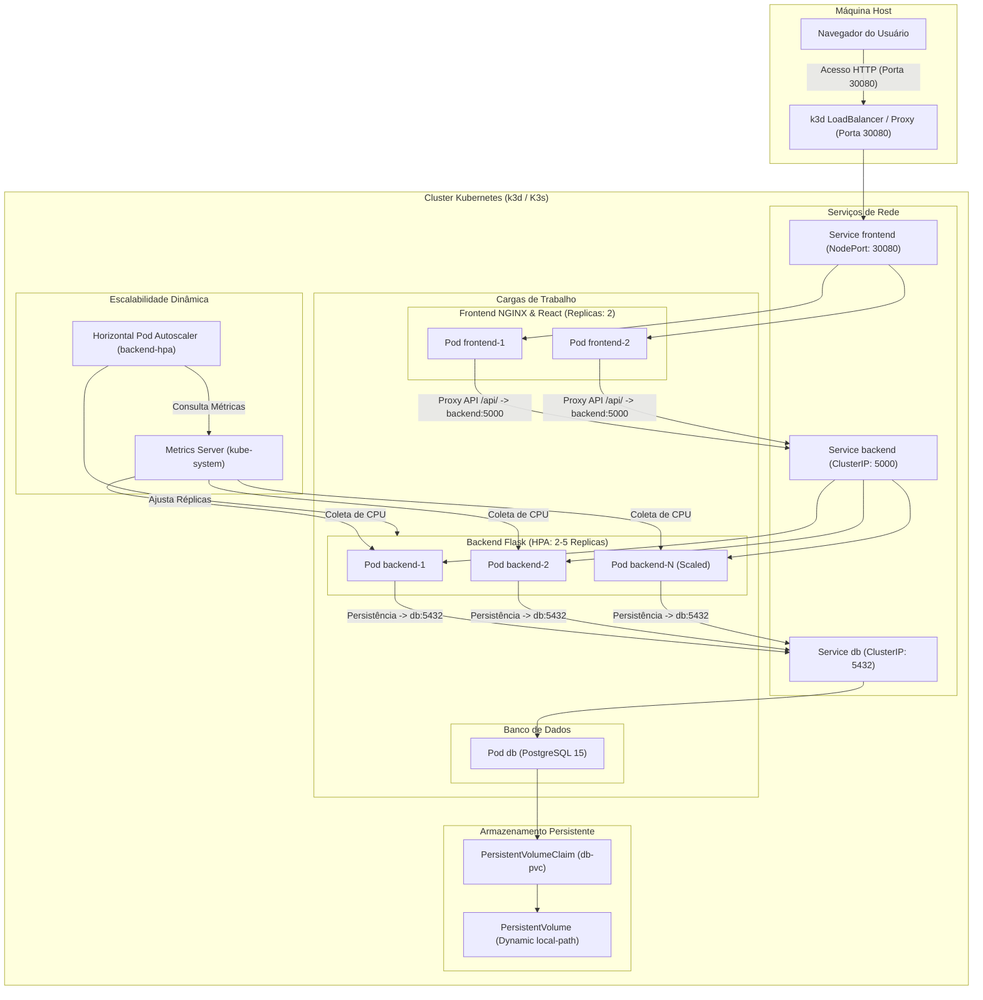

# Guessing Game - Arquitetura de Contêineres Otimizada e Resiliente

Este projeto implementa uma aplicação completa de **Jogo de Adivinhação (Guessing Game)** distribuída e orquestrada em contêineres Docker de maneira profissional, resiliente e escalável. 

A arquitetura engloba:
- **Frontend (React)**: Uma interface web moderna, responsiva, estilizada em HSL Tailored Colors de alto padrão com suporte a Dark Mode e animações de feedback. É empacotada em build estático de produção.
- **Proxy Reverso e Servidor Web (NGINX)**: Serve os arquivos estáticos do React e atua como proxy reverso com balanceamento de carga ativo baseado em DNS dinâmico do Docker para as réplicas do backend.
- **Backend (Flask - Python 3.12)**: Fornece APIs REST robustas para controle de sessão de jogo, validação de palpites e acompanhamento de pontuações de histórico.
- **Banco de Dados (PostgreSQL)**: Armazena dados de jogo com integridade referencial e alta performance.

---

## 🏗️ Arquitetura do Sistema

O fluxo de comunicação segue a seguinte topologia de rede:

```
[Cliente / Navegador]
       │ (Porta 80)
       ▼
┌───────────────────────────────┐
│     Container NGINX           │
│  (Servidor Web & Proxy)       │
└──────────────┬────────────────┘
               │ (Proxy Pass /api/ com DNS Resolver)
               ▼
┌───────────────────────────────┐
│     Docker DNS Round-Robin    │
└──────────────┬────────────────┘
               ├───────────────────────────────┐
               ▼                               ▼
┌───────────────────────────────┐   ┌───────────────────────────────┐
│    Backend Flask (Réplica 1)  │   │    Backend Flask (Réplica 2)  │
└──────────────┬────────────────┘   └──────────────┬────────────────┘
               │                                   │
               └───────────────┬───────────────────┘
                               ▼
               ┌───────────────────────────────┐
               │    Banco PostgreSQL (Ativo)   │
               └───────────────┬───────────────┘
                               ▼ (Volume Persistente)
                       [ Volume pgdata ]
```

---

## 🛠️ Requisitos de Sistema

- **Docker** >= 20.10+
- **Docker Compose** >= 2.20+
- Portas livres no host: `80` (NGINX) e `5432` (opcional, para conexão direta ao DB se necessário)

---

## 🚀 Como Iniciar a Aplicação

### 1. Clonar e Configurar Variáveis
Navegue até a raiz do projeto e crie o arquivo `.env` a partir do template disponibilizado:
```bash
cp .env.example .env
```

*Nota: O arquivo `.env` contém configurações cruciais, como credenciais do Postgres e tags de versão de imagem para atualizações modulares.*

### 2. Executar os Contêineres
Suba todos os serviços em segundo plano:
```bash
docker compose up --build -d
```

Uma vez concluído o build e inicialização, a aplicação estará disponível no endereço:
👉 **[http://localhost](http://localhost)**

---

## ⚖️ Balanceamento de Carga e Escalabilidade do Backend

Para garantir alta disponibilidade e distribuir a carga de requisições, o backend do Flask pode ser replicado de forma dinâmica.

### Como Escalar as Instâncias do Backend:
Execute o comando abaixo para escalar o backend para **3 instâncias**:
```bash
docker compose up -d --scale backend=3
```

### Como Verificar o Balanceamento de Carga:
O NGINX está configurado com um resolvedor DNS dinâmico (`resolver 127.0.0.11`) com TTL de 1 segundo. Sempre que uma nova requisição chega à rota `/api/health`, o NGINX faz uma nova consulta DNS e repassa a carga de forma Round-Robin entre os contêineres disponíveis.

Para validar isso localmente, execute o seguinte loop de teste:
```bash
for i in {1..5}; do curl -s http://localhost/api/health; echo ""; done
```

Você verá que o `container_id` retornado nas respostas se alterna dinamicamente:
```json
{"container_id":"695631ae4ce1","database":"connected","status":"healthy"}
{"container_id":"a43733933203","database":"connected","status":"healthy"}
{"container_id":"3abda4a1cb03","database":"connected","status":"healthy"}
```

---

## 💾 Persistência e Resiliência do Banco de Dados

Os contêineres possuem políticas de reinício automático configuradas no arquivo `docker-compose.yml` (`restart: unless-stopped`). Se um contêiner falhar, ele será reiniciado automaticamente.

### Validação de Persistência dos Dados:
1. Abra **[http://localhost](http://localhost)** e inicie uma partida. Dê alguns palpites para registrar tentativas.
2. Interrompa a execução de toda a infraestrutura apagando os contêineres:
   ```bash
   docker compose down
   ```
3. Suba o ambiente novamente:
   ```bash
   docker compose up -d --scale backend=3
   ```
4. Recarregue a página em seu navegador. O painel lateral esquerdo (Histórico de Partidas) exibirá a partida iniciada anteriormente de forma íntegra. Isso prova que as informações de jogo persistem na pasta física mapeada pelo volume nomeado `pgdata`.

---

## 🔄 Atualização Modular de Versões (CI/CD Ready)

Para atualizar as imagens de forma isolada e profissional sem editar o arquivo `docker-compose.yml`, modifique diretamente as variáveis no arquivo `.env`:

```env
# Component Versions (for modular image updates)
BACKEND_VERSION=1.2.0
FRONTEND_VERSION=1.1.0
POSTGRES_VERSION=15-alpine
```

Após atualizar as versões, basta aplicar as alterações:
```bash
docker compose up -d
```
O Compose detectará as mudanças de imagem e atualizará apenas os contêineres correspondentes.

---

## ☸️ Orquestração com Kubernetes e Helm

O projeto agora conta com suporte de primeira classe à orquestração com **Kubernetes**, incluindo empacotamento modular via **Helm Charts** e automação de ambiente local via **k3d**.

### 1. Arquitetura no Kubernetes

O diagrama abaixo ilustra a topologia física e lógica de rede, armazenamento e escalabilidade no cluster Kubernetes:



### 2. O que o projeto faz, como faz e por que faz

#### O que faz:
Gerencia a implantação, escalabilidade automática e resiliência de um sistema distribuído de 3 camadas (Frontend, Backend e Banco de Dados) no Kubernetes, simulando as condições de um ambiente de produção real localmente.

#### Como faz:
1. **Rede Interna e Resolução de DNS:** Configura um `Service` ClusterIP nomeado `backend` para balancear a carga e mapear o tráfego do frontend via proxy reverso Nginx.
2. **Escalabilidade Automática (HPA):** Utiliza o `HorizontalPodAutoscaler` e o `metrics-server` para auto-escalar o backend de 2 a 5 réplicas baseando-se no uso de CPU.
3. **Persistência de Dados:** Provisiona um `PersistentVolumeClaim` utilizando a classe de armazenamento dinâmica `local-path` do K3s para persistir os dados do Postgres.
4. **Gerenciamento de Pacotes (Helm):** Centraliza as variáveis no `values.yaml` para customizar imagens, réplicas, limites de recursos e portas.

#### Por que faz:
- **Tolerância a Falhas:** Probes de Liveness/Readiness garantem que pods defeituosos sejam restaurados automaticamente e não recebam tráfego.
- **Eficiência de Recursos:** O HPA otimiza o uso de hardware, escalando apenas quando necessário sob picos de tráfego.
- **Simplicidade de Operação (GitOps):** Helm permite empacotar a infraestrutura como código (IaC), permitindo atualizações de versão seguras sem indisponibilidade (RollingUpdate).

### 3. Como Inicializar no Kubernetes

Basta executar o script automatizado na raiz do repositório:
```bash
./start_k8s.sh
```

Acesse o jogo no navegador em: **[http://localhost:30080](http://localhost:30080)**

Para testar o auto-scaling do HPA, execute um gerador de carga:
```bash
kubectl run -i --tty load-generator --rm --image=busybox:1.28 --restart=Never -- /bin/sh -c 'while true; do wget -q -O- http://backend:5000/api/health; done'
```
